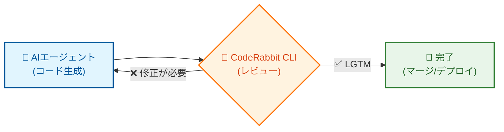
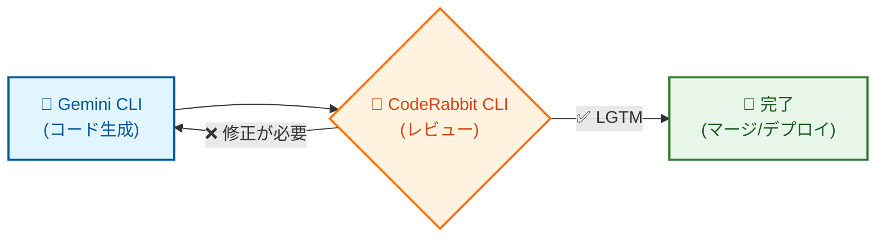

## はじめに

AIにコードを生成してもらった後、レビューするのが大変だと感じたことはありませんか？

この記事では、`CodeRabbit CLI` とAIコーディングエージェント（Gemini, Claudeなど）を連携させて、「生成→レビュー→修正」のサイクルを自動化する方法を紹介します！

## CodeRabbit CLIとは？

一言でいうと、ターミナル上で動くAIコードレビューツールです。
昨今のAIコード生成を用いた開発では、生成されたコードの品質を保つためにレビューが不可欠ですが、そのレビュー作業を効率化するために`CodeRabbit CLI`が役立ちます。

## やってみる（セットアップ）

導入はサクッと終わります！

### 1. インストール

ターミナルで以下を実行します。

```bash
curl -sfL https://cli.coderabbit.ai/install.sh | sh
```

インストールが完了したら、以下のコマンドでバージョンが表示されるか確認しましょう。

```bash
source ~/.zshrc  # または source ~/.bashrc
```

### 2. 認証

次に、アカウントを連携させます。

```bash
coderabbit auth login
```

コマンドを打つとブラウザが開くので、ログインして表示されたトークンをターミナルにペタッと貼り付ければOKです。

↓これでログイン状態が確認できます。

```bash
coderabbit auth status
```

以下のように表示されれば成功です。

```bash
✅ Authentication: Logged in
# 他にもプロフィールなどが表示される
```

## AIエージェントと連携させる

いよいよ本題の連携です。
「AIエージェントにコードを生成させ、CodeRabbitにレビューさせ、その結果を元にまたAIエージェントに修正させる」というループを作ります。



このループのキモになるのが `--prompt-only` フラグです。

```bash
coderabbit --prompt-only
```

これを付けると、レビュー結果がAIエージェントが読みやすいシンプルなテキストで出力されるので、後の修正を自動化しやすくなります。

実は `cr` のエイリアスが設定されているので、以下のように短縮して使うこともできます。

```bash
cr --prompt-only
```

### 連携のイメージ
Gemini CLIを例に、具体的な連携方法を説明します。
（Gemini 3 Proが来てから、よく使うようになりました！）

:::note warn
プランによってレートリミットが異なるので、ループの回数は調整してください
:::


#### 1. GEMINI.md に以下を追記

```markdown:GEMINI.md
Run the CodeRabbit CLI by running the command: `coderabbit --prompt-only -t uncommitted`. It's a long running task and may take up to 30 minutes. Check every 2 minutes if it's complete and once it's done review and validate critical fixes and recommended fixes, while ignoring nits or unecessary changes. Then fix those and run CodeRabbit again. You can run this loop up to 3 times. Let the user know the outcomes.
```

<details><summary>日本語訳</summary>

```markdown:GEMINI.md
コマンド `coderabbit --prompt-only -t uncommitted` を実行してCodeRabbit CLIを起動してください。これは長時間実行されるタスクで、完了まで最大30分かかる場合があります。2分ごとに完了しているか確認し、完了したら重要な修正と推奨される修正をレビューおよび検証し、些細な変更や不要な変更は無視してください。それらを修正して再度CodeRabbitを実行できます。このループは最大3回まで実行できます。結果をユーザーに知らせてください。
```

</details>

#### 2. Gemini CLIでコード生成を実行

上の記載だけでも動くかもしれませんが、自分が試した感じだと使ってくれなかったので、カスタムコマンドを作成して、CodeRabbit CLIの実行を促すようにしてみました！
（雑に書いているので、プロンプトを改善すればもっと良くなると思います！）

```toml:~/.gemini/commands/cr.toml
description = "Prompt for running coderabbit cli"
prompt = """
Once development is complete, run coderabbit --prompt-only.
Run it as long as you need (run in the background) and fix the problem.
"""
```

<details><summary>日本語訳</summary>

```toml:~/.gemini/commands/cr.toml
description = "coderabbit cli 実行用のプロンプト"
prompt = """
開発が完了したら、`coderabbit --prompt-only` を実行してください。
必要なだけ実行し（バックグラウンドで実行）、問題を修正してください。
"""
```

</details>

あとは、カスタムコマンドに続けて、通常通りGemini CLIにプロンプトを与えて実行します。

```bash
/cr hogeを実装して
```

#### 3.  自律的にループが回る
こんなサイクルが自動で実行されます！



実際に動かした例も置いておきます。
ファイル生成されちゃってますが、レビューの後に反復して修正されていました！

```bash
╭────────────────────────────────────────────────────────────────────────────────────────────────────────────────────────────────────────────────────────────────────────────────────────────────────────────────────────────────────────────────────────────────────────────────────────────────────────────╮
│ ✓  Shell coderabbit --prompt-only > coderabbit_output.txt 2>&1 [current working directory /xxx]                                                                                                                                                                               │
│                                                                                                                                                                                                                                                                                                            │
╰────────────────────────────────────────────────────────────────────────────────────────────────────────────────────────────────────────────────────────────────────────────────────────────────────────────────────────────────────────────────────────────────────────────────────────────────────────────╯
╭────────────────────────────────────────────────────────────────────────────────────────────────────────────────────────────────────────────────────────────────────────────────────────────────────────────────────────────────────────────────────────────────────────────────────────────────────────────╮
│ ✓  ReadFile coderabbit_output.txt                                                                                                                                                                                                                                                                          │
│                                                                                                                                                                                                                                                                                                            │
╰────────────────────────────────────────────────────────────────────────────────────────────────────────────────────────────────────────────────────────────────────────────────────────────────────────────────────────────────────────────────────────────────────────────────────────────────────────────╯
╭────────────────────────────────────────────────────────────────────────────────────────────────────────────────────────────────────────────────────────────────────────────────────────────────────────────────────────────────────────────────────────────────────────────────────────────────────────────╮
│ ✓  Edit # 省略
╰────────────────────────────────────────────────────────────────────────────────────────────────────────────────────────────────────────────────────────────────────────────────────────────────────────────────────────────────────────────────────────────────────────────────────────────────────────────╯
╭────────────────────────────────────────────────────────────────────────────────────────────────────────────────────────────────────────────────────────────────────────────────────────────────────────────────────────────────────────────────────────────────────────────────────────────────────────────╮
│ ✓  Edit # 省略
╰────────────────────────────────────────────────────────────────────────────────────────────────────────────────────────────────────────────────────────────────────────────────────────────────────────────────────────────────────────────────────────────────────────────────────────────────────────────╯
╭────────────────────────────────────────────────────────────────────────────────────────────────────────────────────────────────────────────────────────────────────────────────────────────────────────────────────────────────────────────────────────────────────────────────────────────────────────────╮
│ ✓  Shell coderabbit --prompt-only > coderabbit_output_2.txt 2>&1 [current working directory /xxx]                                                                                                                                                                             │
│                                                                                                                                                                                                                                                                                                            │
╰────────────────────────────────────────────────────────────────────────────────────────────────────────────────────────────────────────────────────────────────────────────────────────────────────────────────────────────────────────────────────────────────────────────────────────────────────────────╯
╭────────────────────────────────────────────────────────────────────────────────────────────────────────────────────────────────────────────────────────────────────────────────────────────────────────────────────────────────────────────────────────────────────────────────────────────────────────────╮
│ ✓  ReadFile coderabbit_output_2.txt                                                                                                                                                                                                                                                                        │
│                                                                                                                                                                                                                                                                                                            │
╰────────────────────────────────────────────────────────────────────────────────────────────────────────────────────────────────────────────────────────────────────────────────────────────────────────────────────────────────────────────────────────────────────────────────────────────────────────────╯
╭────────────────────────────────────────────────────────────────────────────────────────────────────────────────────────────────────────────────────────────────────────────────────────────────────────────────────────────────────────────────────────────────────────────────────────────────────────────╮
│ ✓  Edit # 省略
╰────────────────────────────────────────────────────────────────────────────────────────────────────────────────────────────────────────────────────────────────────────────────────────────────────────────────────────────────────────────────────────────────────────────────────────────────────────────╯
╭────────────────────────────────────────────────────────────────────────────────────────────────────────────────────────────────────────────────────────────────────────────────────────────────────────────────────────────────────────────────────────────────────────────────────────────────────────────╮
│ ✓  Shell coderabbit --prompt-only > coderabbit_output_3.txt 2>&1 [current working directory /xxx]                                                                                                                                                                             │
│                                                                                                                                                                                                                                                                                                            │
╰────────────────────────────────────────────────────────────────────────────────────────────────────────────────────────────────────────────────────────────────────────────────────────────────────────────────────────────────────────────────────────────────────────────────────────────────────────────╯
╭────────────────────────────────────────────────────────────────────────────────────────────────────────────────────────────────────────────────────────────────────────────────────────────────────────────────────────────────────────────────────────────────────────────────────────────────────────────╮
│ ✓  ReadFile coderabbit_output_3.txt                                                                                                                                                                                                                                                                        │
│                                                                                                                                                                                                                                                                                                            │
╰────────────────────────────────────────────────────────────────────────────────────────────────────────────────────────────────────────────────────────────────────────────────────────────────────────────────────────────────────────────────────────────────────────────────────────────────────────────╯
╭────────────────────────────────────────────────────────────────────────────────────────────────────────────────────────────────────────────────────────────────────────────────────────────────────────────────────────────────────────────────────────────────────────────────────────────────────────────╮
│ ✓  Shell rm coderabbit_output.txt coderabbit_output_2.txt coderabbit_output_3.txt [current working directory /xxx]                                                                                                                                                            │
│                                                                                                                                                                                                                                                                                                            │
╰────────────────────────────────────────────────────────────────────────────────────────────────────────────────────────────────────────────────────────────────────────────────────────────────────────────────────────────────────────────────────────────────────────────────────────────────────────────╯
```

### 他エージェントとの連携
Claude CodeやCodex、Cursorなど他のエージェントでも同じようなことができます。
それぞれのエージェントに「`coderabbit`っていうツールが使えるよ」と教えてあげる設定が必要ですが、基本的な流れは同じです。

AIエージェント |	設定ファイル
---------------|--------------------------
Claude Code	| CLAUDE.md
Codex	| AGENTS.md
Cursor	| cursor.md

## 頻出オプションリファレンス
よく使いそうなオプションをまとめました！

| コマンド | 説明 |
| --- | --- |
| `--plain` | プレーンテキスト形式で出力 |
| `--prompt-only` | AIエージェント向けに最適化された最小限の出力を表示 |
| `-t, --type <type>` | レビュータイプ: all, committed, uncommitted (default: “all”) |
| `--base <branch>` | 比較対象のベースブランチ |

## おわりに
読んでいただきありがとうございます！
`CodeRabbit CLI` を使うと、リンターでチェックできないバグなども検出できて、CLIなので他のAIエージェントと連携しやすくてとても便利でした！
ぜひ試してみてください！
